# 数理逻辑

---

----

## 命题逻辑

---

### 1 命题与联结词

> <u>命题</u>是**最基本单元**；<u>联结词</u>相当于**代数运算**，连接命题

#### 1.1 命题

##### 1.1.1 相关概念

命题：

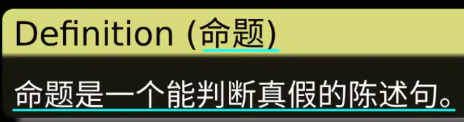

> 悖论不是命题

原子命题：

> 不能再拆，再拆就不是命题了

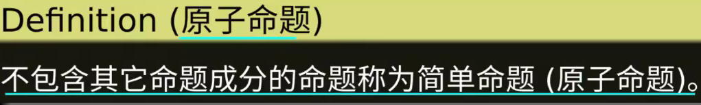

复合命题：

> 用联结词连接原子命题得到的

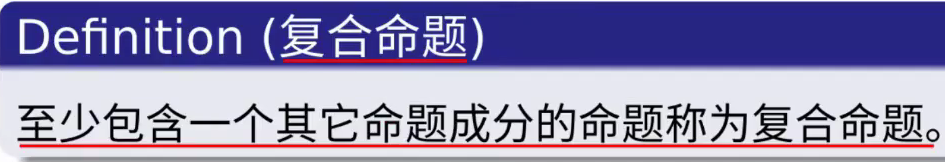

> 支命题：
>
> 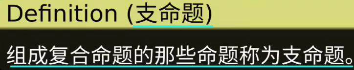
>
> 支命题也可以是复合命题

##### 1.1.2 命题的真假

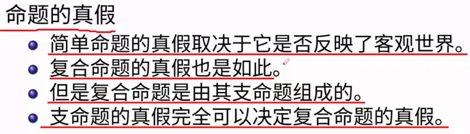

#### 1.2 联结词

##### 1.2.1 逻辑联结词

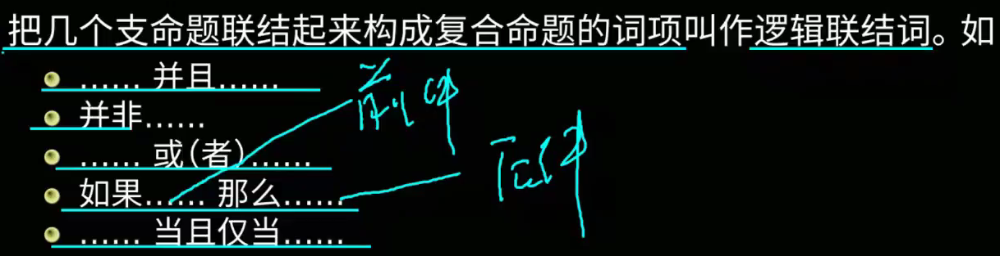

> 自然语言中的联结词
>
> 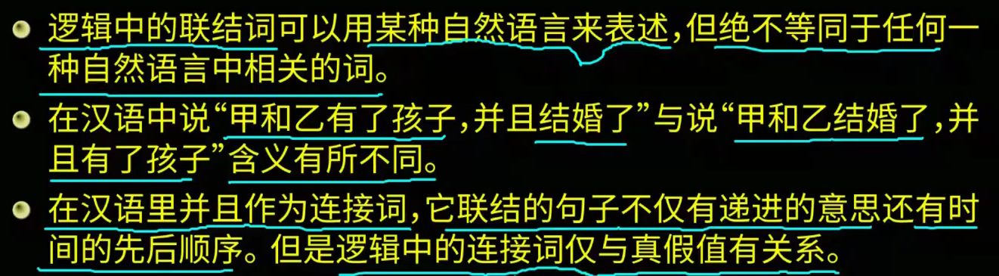

##### 1.2.2 联结词的符号表示

- 否定词：$\neg$

- 合取词：$\and$

- 析取词：$\or$

- 蕴含词：$\rarr$

  > $p\rarr q$叫做p蕴含q

- 等价词：$\lrarr$

> 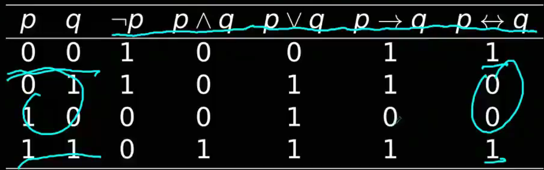
>
> 只有前件为真后件为假时，蕴含词连接的命题才是假的；
>
> 推理的有效性规定，假的前提可以推出任意命题；真命题一定只能推出真命题，不能推出假命题

##### 1.2.3 符号化表示

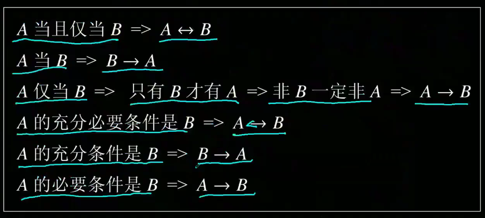

> 注意：**A当B**、**A仅当B**的概念

> 逆否命题可以直接推出

#### 1.3 真值函数

真值函数的定义

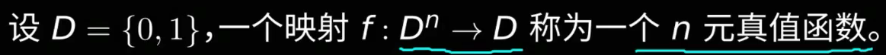

> 0、1代表真假
>
> 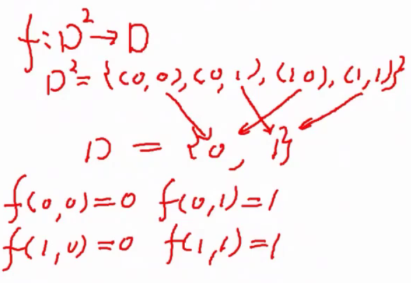

逻辑联结词与真值函数

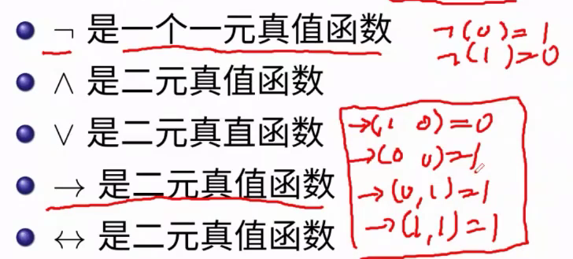

> 中缀表示与前缀表示：
>
> 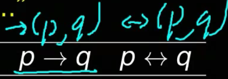

---

### 2 形式语言与命题公式

> 建立**讨论对象**——命题公式，这也是一类特殊的形式语言

#### 2.1 形式语言

字母表、字符串、形式语言：

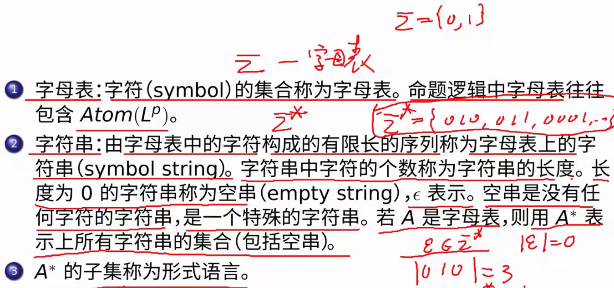

> 形式语言是字符串的集合
>
> 所有形式语言的集合：$2^{A^*}$
>
> $Atom(L^p)$指的是所有**原子命题**的集合

$\Sigma^*$、拼接运算、幺半群：

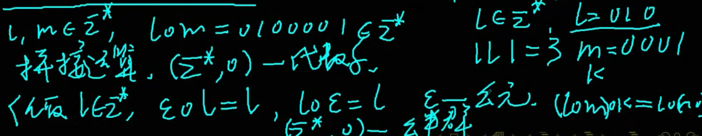

#### 2.2 命题变项和指派

命题变项/命题变元：

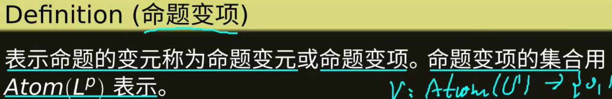

指派或赋值：

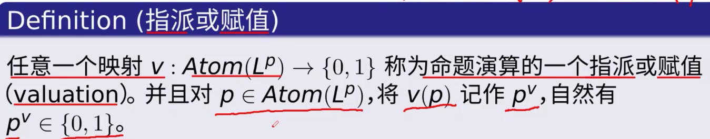

> 这是对**原子命题**的指派

#### 2.3 命题公式

命题公式的定义：

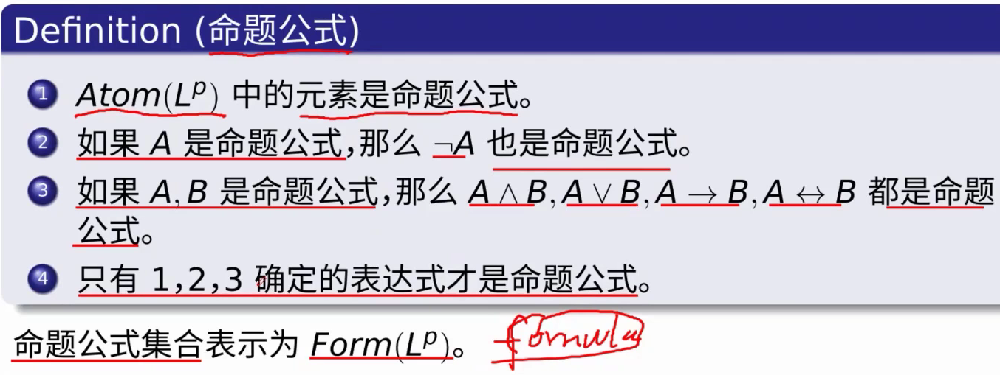

> 递归定义，
>
> - 第一条是初值
> - 第二条是用一元真值函数递推
> - 第三第是用二元真值函数递推

> 原子命题的集合是$Atom(L^p)$，只包含**原子命题**；
>
> 命题公式的集合是$Form(L^p)$，包含所有**命题**；
>
> 命题变项指的是原子命题，命题公式包括原子命题和复合命题

语法分析树：

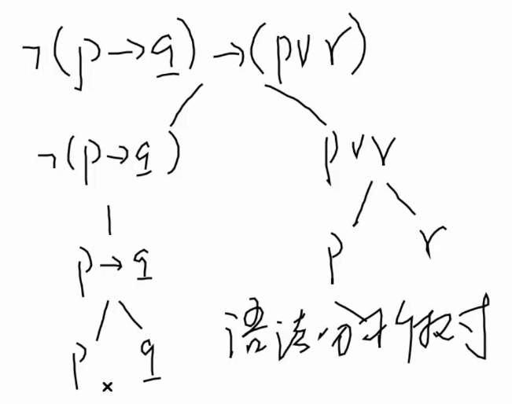

公式形成过程/序列：

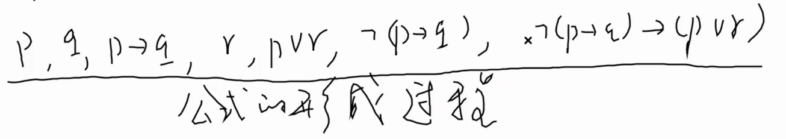

> 可以对**序列的长度**使用<u>数学归纳法</u>

联结词的**优先级**：

- 非 > 合取、析取 > 蕴涵、等价

#### 2.4 命题公式的赋值

弄真与弄假：

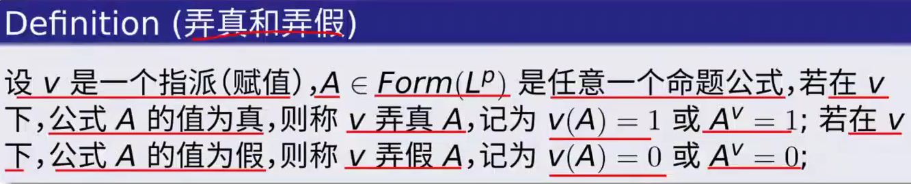

> 这里是对原子命题+复合命题的定义。这里说在v下公式A为真或假，也就是这个指派的结果，但<u>对命题公式(原子命题+复合命题)的指派</u>还没有正式定义，目前的理解就是，让指派作用于所有原子命题，然后再利用一堆联结词的真值表
>
> 但这样一下作用到所有原子命题，拆得太细了。<u>命题公式本身就是递归定义的</u>，那能不能对命题公式的指派也递归定义呢，这样一层一层分解递归更好一些

指派的递归定义：

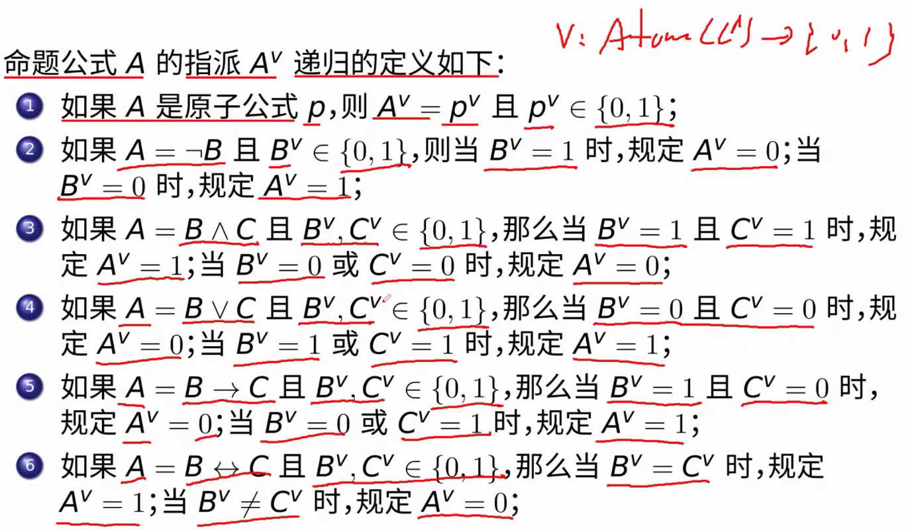

#### 2.5 命题赋值的计算

> 根据指派的递归定义规定的公式

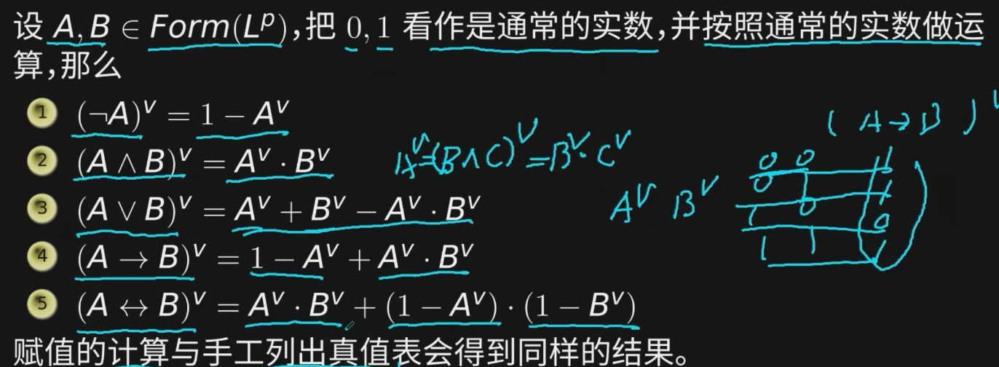

> 4：A为假或者A和B都真的时候，A$\rarr$B才是真
>
> 5：A和B同假或同真时，A$\lrarr$B才是真

#### 2.6 公式赋值的性质

:sunny:真值的确定性：

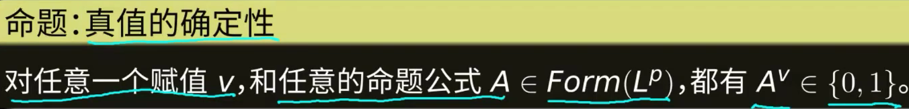

> 证明：
>
> 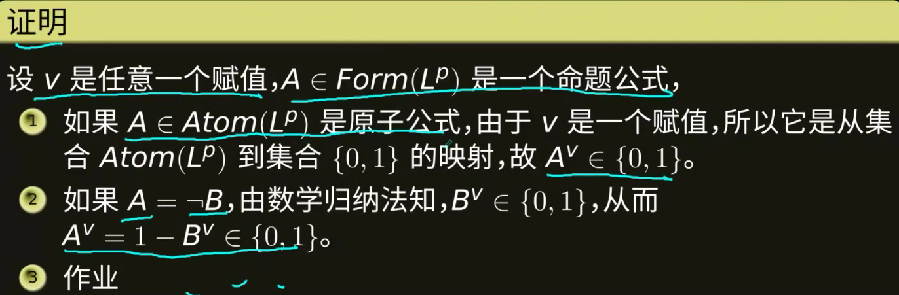
>
> 会用到第二数学归纳法。
>
> 这里的“由数学归纳法知”的意思就是，“由**归纳假设**知”

#### 2.7 命题公式的分类

永真式、永假式、可满足的

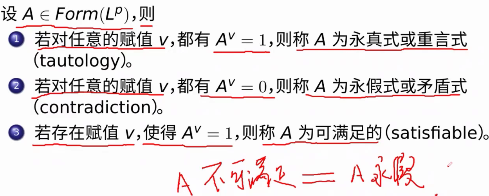

> **不可满足的** 和 永假的 是一个意思

永真式的判定：

- 真值表方法

  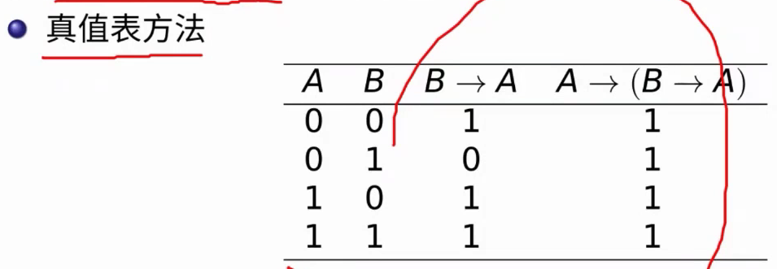

  > **后件为真**则蕴含词一定为真，据此可以得到$A\rarr(B\rarr A)$
  >
  > **前件为假**则蕴含词一定为真，据此可以得到$\neg B\rarr(B\rarr A)$

- 计算方法

  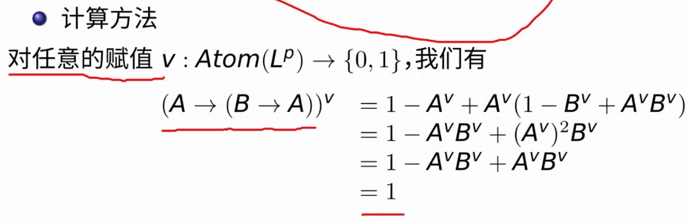

- 反证法

  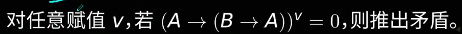

  > 蕴含词为0只有一种情况，比较容易用反证法

永假式的判定：

- 真值表

  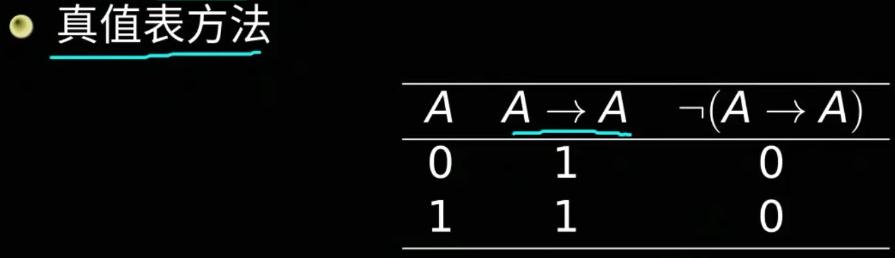

- 计算方法

  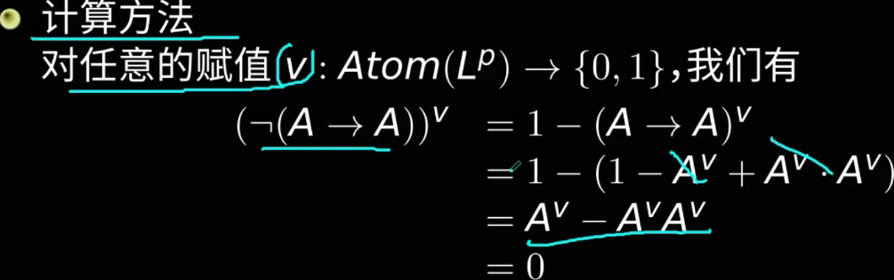

可满足公式的判定：

- 真值表方法

  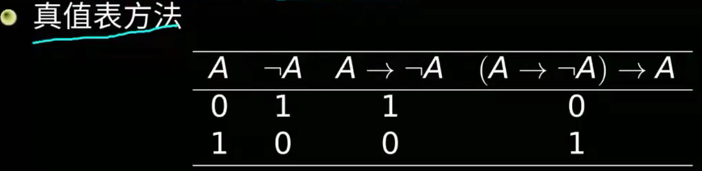

- 计算方法

  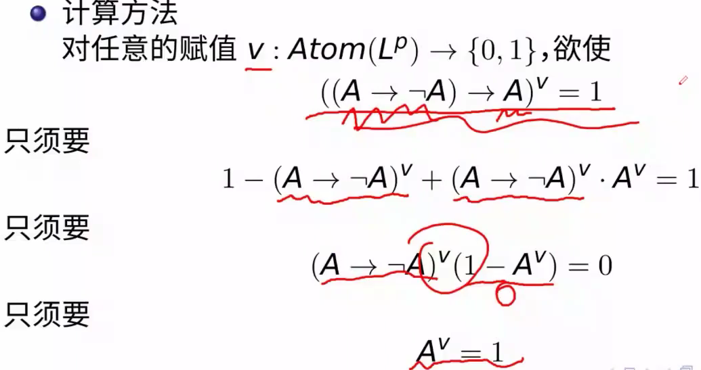

#### 2.8 逻辑蕴含和逻辑等价

:moon:逻辑蕴含：

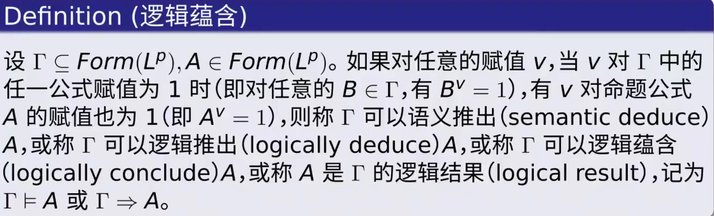

> 注意理解这里的“任意”：
>
> - 任意v指的是对**任何一个指派v**，如果有下列性质，则......
> - 任意公式指的是对于命题公式集合$\Gamma$中**所有的命题公式**，都成立

> 若$\Gamma=\phi$，则A为永真式

> 举例：证明的时候，用命题赋值公式代入即可
>
> 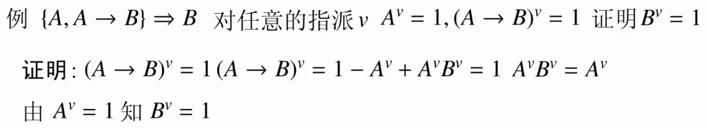
>
> 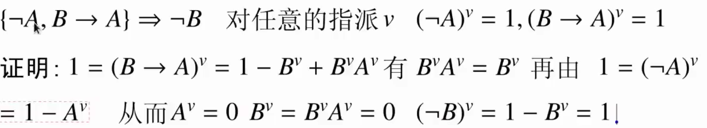

:moon:逻辑等价：

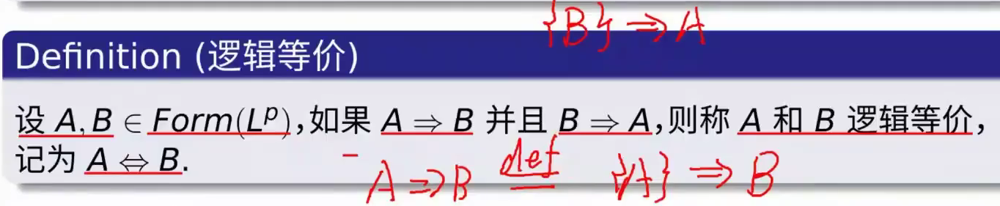

> 一个命题公式逻辑蕴含另一个命题公式，定义为：左边这个单独的命题公式构成的集合逻辑蕴含右边的命题公式

> 逻辑等价的**<u>重要推论</u>**：
>
> 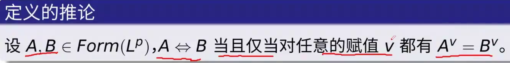
>
> > 命题公式也是一种真值函数，命题公式逻辑等价说明这两个真值函数也是相等的
>
> 证明：
>
> 必要性：要证$A^v=B^v$，分类讨论，$A^v$分别等于0或1
>
> 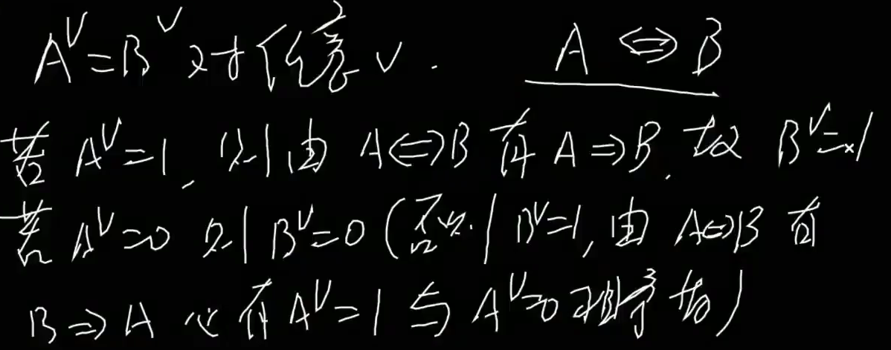
>
> > 为了利用逻辑蕴含的定义，使用了反证法
>
> 充分性：要证$A^v\Lrarr B^v$，用逻辑蕴含的定义即可，很显然

:sunny:逻辑蕴含和逻辑等价的性质：

> 其实是在说明逻辑蕴含与蕴含的关系、逻辑等价与等价的关系

- 逻辑蕴含

  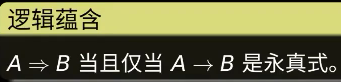

  > 必要性：
  >
  > 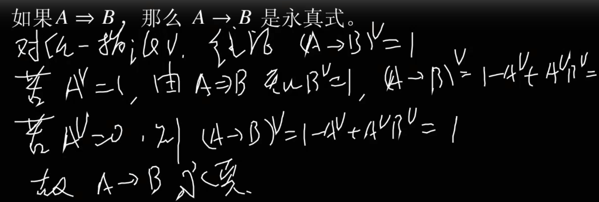
  >
  > > 注意这里对“<u>任意指派</u>”的分类讨论，是用$A^v$的取值来区分的
  >
  > 充分性：
  >
  > 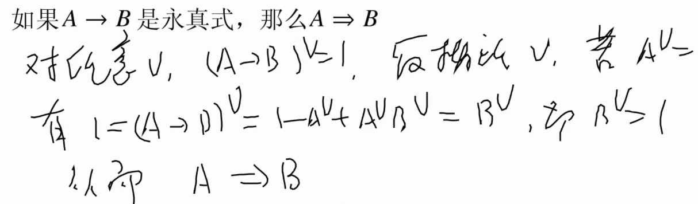

- 逻辑等价

  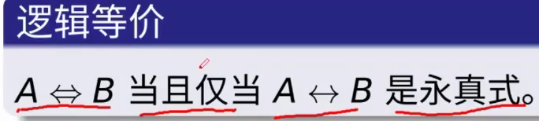

  >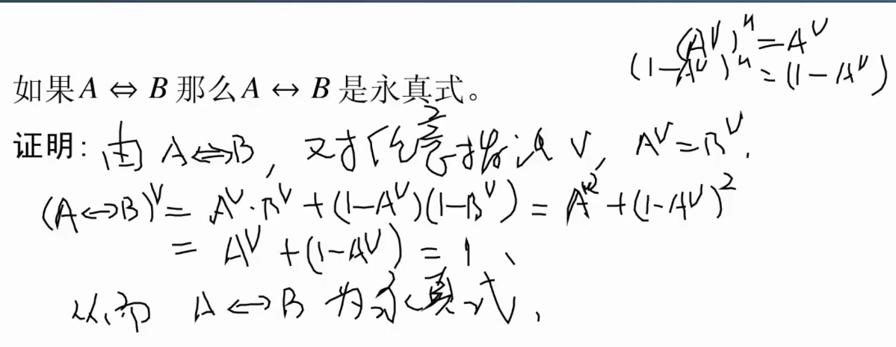
  >
  >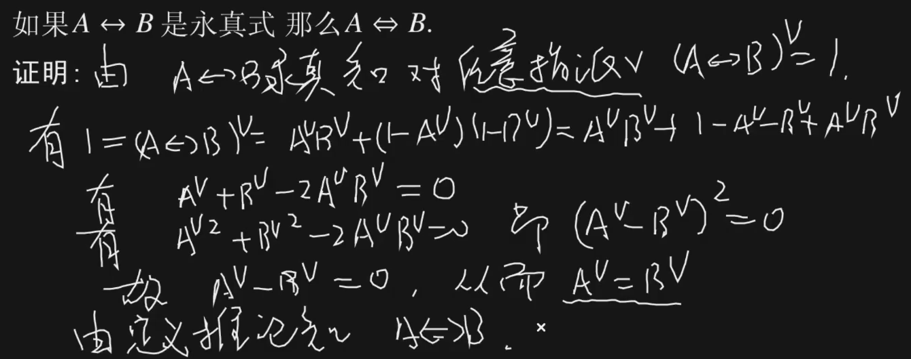

- **逻辑等价**是$Form(L^p)$上的<u>等价关系</u>

  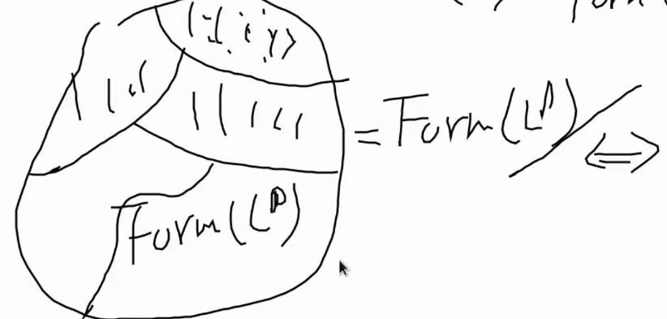

  > 等价类的个数是可以算出来的

#### 2.9 常见逻辑等价式

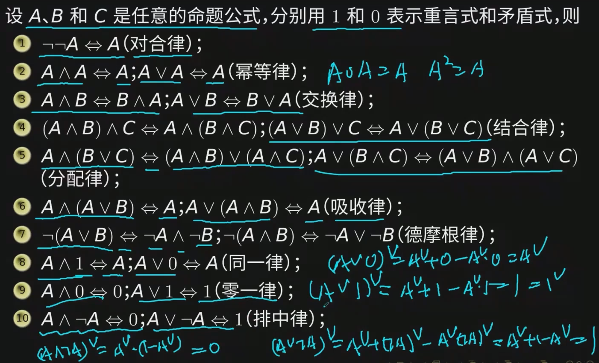

> 证明都是使用逻辑等价的定义：对任意的指派v，都有两个指派后的值相等。
>
> 值得注意的证明思路：
>
> - 注意都要说明<u>对任意的指派v</u>
> - 想证明两个式子相等，可以把它们都推向一个中介

#### 2.10 代入定理和替换定理

:sunny:代入定理：

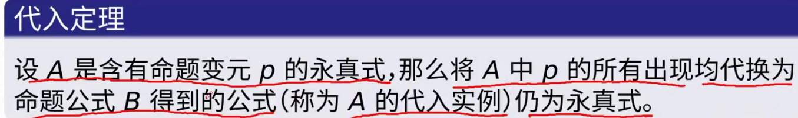

> 就相当于一个常函数，不管自变量怎么变，函数值都是常数

> 举例：
>
> 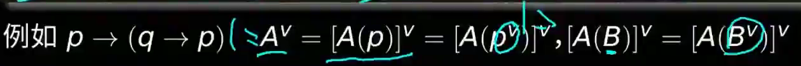

:sunny:替换定理：

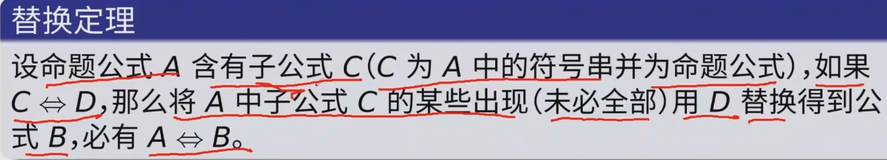

> 对长度归纳：
>
> 

> 举例：
>
> 

---

### 3 范式

> 典范的式子

#### 3.1 范式的定义


涉及到的定义：

- 合取/析取范式：子句的合取/析取式

- 子句(Clause)：文字的析取/合取式

  > 子句可以没有文字，称为空子句；
  >
  > 子句中如果只有较少的文字，可能会引发歧义
  >
  > > 比如$p\wedge q$，既是合取范式又是析取范式；
  > >
  > > 这个冲突问题可由主合取/析取范式解决

- 子句的文字(Letter)：命题**变元**及其否定（正文字和负文字）

> 理解：逻辑等价划分出了很多等价类，每个等价类中，都可以有一些比较规范、常用的命题公式形式，并且与其他一些命题等价，这些比较规范、常用的命题公式就是范式

#### 3.2 求取范式

:moon:范式定理


> 辖域就是管辖范围；
>
> 

> 举例：
>
> 
>
> 本题中，用结合律得到了析取，用分配律得到了合取，用**替换定理**进行化简

#### 3.3 主范式

:sunny:主范式定义


:sunny:极大项与极小项：

- 极大项：主合取范式中的析取项
- 极小项：主析取范式中的合取项

> :moon:极大项与极小项性质
>
> 极大项：
>
> 
>
> 极小项：
>
> 

#### 3.4 求解主范式

求解步骤：


> 举例：
>
> 先合取/析取，再主合取/析取
>
> 
>
> 这样求解比较麻烦，有没有更好的方法？有，通过指派和真值表

#### 3.5 弄假弄真指派与范式

:moon:弄**假**与主**合取**范式：

> 要弄假的是谁？子句
>
> 为什么主**合取**范式非要和弄**假**扯上关系？因为主合取范式**一个子句被弄假**了的话，**整个主合取范式就是假的**。事实上，==一个指派只能弄假一个最大项==

- 弄假指派的**唯一性**：

  

  

  > 命题1和命题2是一个意思

- 主合取范式与弄假指派的互相求解：

  

  > 每**一个弄假指派**实质上是只能**弄假**<u>主合取范式</u>中的其中**一个子句**，
  > 从而使得整个合取范式为假

  

  > 每个弄假指派对应一个子句

:moon:弄**真**与主**析取**范式：

> 同理


:moon:主范式与指派：

- 范式写不出：

  

- 主范式唯一性：

  

- 主合主析转化：

  

  > 理解：
  >
  > 
  >
  > 

#### 3.6 n元联结词的个数


> n元就是n种命题变元，也就是n种原子命题；
>
> 等价划分的依据？逻辑等价，即对于任意指派，赋值后结果都相等（不是0就是1）
>
> 用下面的图体现：
>
> - 任意指派：一共有$2^n$种，一行一行都写出来了
> - 对于任意指派(那$2^n$种指派)，都有相同的结果，把所有的结果一列一列的写出来，不是0就是1，两种选择，是2的多少次幂呢，左边写了，是$2^{2^n}$次幂
>
> 

> 例题：
>
> 
>
> 真值表法：
>
> 
>
> 一些书写规范：
>
> 
>
> 

---

### 4 联结词的扩充与归约

> 扩充更多的联结词，找到联结词之间的关系（归约）

> 认为**联结词**与**命题公式**本质上都是一种真值函数

#### 4.1 一、二元联结词

一元联结词表格：


> 这四种简单的联结词其实都代表了<u>一类联结词</u>

二元联结词表格：


> 值得注意的点：
>
> - $x_i\Lrarr\neg x_{17-i}$
> - 每个都可以用之前学过的简单联结词表示
> - 某个看不出来的，可以尝试看它的逻辑等价式

二元联结词定义：


> - 投影就是只选其中一个
>
> - 或非就是**先或再非**
>
> - 异或就是先让它们**异**，再让这些结果们**或**
>
>   > 等价再取非

#### 4.2 联结词的表示与完备词组

联结词的可表示：


完备联结词组：


> 能表示所有一元、二元的，其实就已经可以表示n元的了，下面有一个例子就证了这个

> :sunny:完备联结词组举例：
>
> 
>
> 
>
> > 证明：
> >
> > 
> >
> > 
>
> 
>
> > 证明：证明思路都类似，都是用其来<u>表示否定词、合取词、析取词</u>
> >
> > 
>
> > 
> >
> > 这里碰巧比较简单，但其实大部分情况下会很复杂
>
> 上升到n元的完备：
>
> 
>
> > 证明：
> >
> > 
> >
> > 后面都同理了

#### 4.3 对偶式与内否式

对偶式的定义：


> 合取析取互换、永真永假互换

> 对偶式的性质：
>
> - $(A^*)^*=A$
>
> - $(\neg A)^*=\neg A^*$
>
>   > <u>先非再对偶</u>和<u>先对偶再非</u>是相同的结果

内否式的定义：


> 内否式的性质：
>
> - $(A^-)^-\Lrarr A$
>
>   > 注意这里不是字符串完全相等，而是逻辑等价，因为字符串长了(多个两个$\neg$)
>
> - $(\neg A)^-=\neg A^-$
>
>   ><u>先非再内否</u>和<u>先内否再非</u>是相同的结果
>
> - $(A^-)^v=A^{v^-},v(p)=1当且仅当v^-(p)=0$

> 举例：
>
> 

相关定理汇总：


> 第3个就相当于<u>德摩根公式</u>；
>
> 第5个是可以由第3个推出的，代入后出现两层$^-$，直接**逻辑等价**


> 证明：通过引入$\neg$
>
> 


> 证明：
>
> 
>
> 中间用到了代入定理

---

### 5 命题演算形式系统PC

> PC是形式化的公理系统，三条公理+一条推理规则，定理与演绎

#### 5.1 语言部分

PC的字母表：


> 后面的所有字母正是$Atom(L^p)$，再加一个完备联结词组，再加两个助记符

PC的公式：


> 是$\Sigma^*$的子集，是一些“有规矩”的字符串；
>
> (1)和(2)需要有限次

#### 5.2 推理部分

公理集合：


> A、B、C均为PC中的公式；这也叫公理模板/公理模式；就都是**永真式**；
>
> > 公理能当成模板正是因为代入定理

> 在证明中：
>
> - 公理一常用于消去某个不需要的项或添加某个项
> - 公理二常用于靠近命题形式

推理规则：


> 用于**扩展定理**的；
>
> 
>
> 就是<u>用永真式再推永真式</u>

> 一个常用的证明方法就是：带有蕴含词的公理，当已知形式化前件成立时，想直接得到后件，就需要引入公理，然后分离出后件

#### 5.3 证明和定理

证明的概念：


> $A_i$要么是<u>公理</u>，要么<u>和之前的一样</u>，要么<u>由之前的两个导出</u>

> 这个序列中能不能出现定理呢？可以，因为定理也有证明序列，把这个**子序列**代入即可

定理的概念：


- $\vdash$

- 公理是定理

- 证明序列中的<u>第一个公式</u>一定是**公理**

  > 那它是定理可以吗？之后探讨这个问题

- 证明序列的子序列也是证明，所以<u>证明序列上的所有公式都是定理</u>

#### 5.4 演绎和演绎结果

演绎的定义：


> 也是一种公式序列；“证明”是“演绎”的特例，就是当$\Gamma=\phi$的时候

演绎结果：


> 是在“定理”的符号基础上，前面加了一个$\Gamma$；
>
> - $\phi\vdash_{PC} A$，也就是A是定理

---

### 6 命题演算形式系统PC的定理

> PC中的基本定理

> :star:总结：
>
> - 证明的思路
>   - 反证思想
>
>     > 一是指定理16那套模式，二是指在证明时**构造矛盾**，例如：
>     > $$
>     > A\rarr\neg B\\
>     > A\rarr B
>     > $$
>
>   - 逆否互换
>
>   - 前件互换
>   
>   - 相似定理靠近/构造定理的形式（从合适的**已知**出发）
>   
>     > **画图图法**，通过加前件与后件去搭桥
>   
>     > 常用的有反证定理9、11，前件为假定理6、7（当然这样舍弃了后件，不一定能成功），
>     >
>     > > $$
>     > > 要证:A\rarr(\triangle\rarr\square)\\
>     > > 已知A\rarr(\neg A\rarr\square)\\
>     > > 只需(\neg A\rarr\square)\rarr(\triangle\rarr\square)\\
>     > > 只需\triangle\rarr\neg A
>     > > $$
>     >
>     > 有的时候发现题目中有形式相似的定理，那就必须要尝试使用到这个定理，这或许是关键
>
>   - 提取相同前后件
>
>     > 有时候会使用**公理二**去提取相同前件，不然证不出来了；
>     >
>     > 有时在出现多个相同后件时，或许需要都用逆否换成相同前件，再用公理二复用相同的前件，才能证明出来
>
>   - ABC定理18和定理23
>   
>     > 这个定理好用就好用在，它分解了**前件中的括号**
>   
>   - 三段论**转移目标法**（从证明**目标**出发）
>   
>     > 前面的几个思路都可能会结合这个展开，已知与目标**相同的前件**、**相同的后件**，都可以用
>   
>     > 注意不能太盲目地用这个方法，还需要结合已知条件，有时可能用公理二会更好

#### 6.1 废话定理1

$$
\vdash_{PC}A\rarr A
$$

> 证明思路：
>
> > 本质思想——找到一个**证明序列**
>
> 从定理1出发，为了构造出$A\rarr A$，将中间的$B$替换了
>
> 

#### 6.2 前件互换定理2

$$
如果\vdash_{PC}A\rarr(B\rarr C)，那么\vdash_{PC}B\rarr(A\rarr C)
$$

> 证明：
>
> 

#### 6.3 前件互换定理3

$$
\vdash_{PC}(A\rarr(B\rarr C))\rarr(B\rarr(A\rarr C))
$$

> 证明：
>
> 思路：
>
> 1. 先用公理2构造出定理3的形式，然后用前件互换定理2更近一步接近这个形式，
>
> 2. 接下来要消去$A$，就要用到公理1，把整体当成一部分
>
>    > 消去A的时候换出来消更好
>
> 3. 再用公理2分配进去，用公理1分离，用定理2接近形式
>
>    > 难点是第1步和第2步，到达第3步的时候思路就已经十分畅通了
>
> 

#### 6.4 加前件定理4

$$
\vdash_{PC}(B\rarr C)\rarr((A\rarr B)\rarr(A\rarr C))
$$

> 证明：
>
> 

#### 6.5 加后件定理5

$$
\vdash_{PC}(A\rarr B)\rarr ((B\rarr C)\rarr(A\rarr C))
$$

> 证明：
>
> 定理4用前件互换定理2

#### 6.6 前件为假定理6

$$
\vdash_{PC}\neg A\rarr(A\rarr B)
$$

> 证明：
>
> 
>
> > 思路：用公理3靠近形式，用公理1消除不需要的命题公式

#### 6.7 前件为假定理7

$$
\vdash_{PC}A\rarr(\neg A\rarr B)
$$

> 证明：
>
> 定理6用前件互换定理2

> 理解：相当于$A\rarr A\vee B$

#### 6.8 三段论定理8

$$
若\vdash_{PC}A\rarr B，\vdash_{PC}B\rarr C，则\vdash_{PC}A\rarr C
$$

> 证明思路：
>
> 用<u>加后件定理/加前件定理</u>构造定理**形式**，再分离
>
> 

#### 6.9 反证思想定理9

$$
\vdash_{PC}(\neg A\rarr A)\rarr A
$$

> 证明思路：
>
> 感觉好像把定理7反过来就可以，但需要<u>间接</u>的将其反过来，即使用<u>定理6+公理3</u>，再使用三段论
>
> 
>
> 要证$B\rarr A$，先证$B\rarr(B\rarr A)$也可以

> 这其实是反证法思维

#### 6.10 自反定理10

$$
\vdash_{PC}\neg\neg A\rarr A
$$

> 证明：
>
> 使用**定理6**构造<u>定理形式</u>
>
> 使用<u>三段论</u>得出定理
>
> 

#### 6.11 反证思想定理11

$$
\vdash_{PC}(A\rarr\neg A)\rarr\neg A
$$

> 证明思路：
>
> 可能会想到先把定理9的$A$换成$\neg A$，但这样的话，前面就剩下了$\neg\neg A$，微小差异不好处理。
>
> 可以尝试构造定理9这样的形式，看看哪有$\neg\neg A$，发现**定理10**有，但缺少一些东西，可以使用**加后件定理5**
>
> 

#### 6.12 自反定理12

$$
\vdash_{PC}A\rarr \neg\neg A
$$

> 证明思路：
>
> 以三段论为核心，想想$A$能蕴含啥，还要有非，自然想到定理7，关键是把这个$B$换成什么，可以想到反证思想定理11，假设蕴含了什么，就蕴含了什么
>
> 

> 这两个自反定理分别用到了前面的两个前件为假和反证思想定理

#### 6.13 逆否定理13

$$
\vdash_{PC}(A\rarr B)\rarr (\neg B\rarr\neg A)
$$

> 证明思路：
>
> 核心——<u>公理3+三段论</u>，但为了得到那个三段论中的一段，需要自行构造出$A\rarr B$，这就可以使用<u>加前件</u>与<u>加后件</u>了
>
> 
>
> 就是用公理三接近形式，从而想到(8)的样子

#### 6.14 否定互换定理14

$$
\vdash_{PC}(\neg A\rarr B)\rarr(\neg B\rarr A)
$$

> 证明思路：
>
> 公理3+三段论定理8+加前件定理4
>
> 

#### 6.15 否定互换定理15

$$
\vdash_{PC}(A\rarr\neg B)\rarr(B\rarr\neg A)
$$

> 公理3+三段论定理8+加后件定理5
>
> 

#### 6.16 反证思想定理16

$$
\vdash_{PC}(\neg A\rarr B)\rarr((\neg A\rarr\neg B)\rarr A)
$$

> 假设A不成立，立即得到B，但之后又根据A不成立推出了B不成立，则假设不成立

> :star:**重要证明思路**：
>
> （对于这种形式较复杂）为了使用<u>公理2</u>，构造<u>一致前件</u>，用到了逆否命题，再逆否，再前件互换，再逆否
>
> > 其中用到了多次三段论，其实就是分离规则的封装
>
> 
>
> 这样再反着写回去
>
> 

> :star:==**反证思维的运用**==：证明一个复杂**蕴含式**为**假**
>
> > 蕴含式为假，只有前件为真后件为假这一种情况
>
> 举例：
>
> 
>
> 一次运用：
>
> 
>
> 两个矛盾：
>
> 
>
> 
>
> - 找到了证明目标：$((A\rarr B)\rarr A)\rarr A$
> - 找到了矛盾点：$A\rarr B$
>
> 证明过程书写：怎么分析就怎么写
>
> 
>
> 一次运用：
>
> 
>
> 
>
> 两个矛盾：
>
> 
>
> > 角度一：前件必须为真，而又已经其中的后件为假，则其中的前件必为假；
> >
> > 这里写得比较长是因为其中还蕴含了A一定为假的分析
>
> 
>
> > 角度二：后件必须为假，则拿我这个后件当前件的命题公式一定为真
>
> > 这两个矛盾会和前面拼接起来
>
> 接下来就是要找证据，让这4句都成立
>
> 
>
> 
>
> 
>
> 
>
> 然后就是运用**三段论**（和**分离规则**），拼接出反证思维定理16的形式：
>
> 
>
> 
>
> 
>
> 
>
> 
>
> 最后使用两次分离规则，得出最终结论：
>
> 
>
> > 

> :star:另一种证明方式：<u>逆否定理13+三段论定理8</u>
>
> > <u>这种思路目前暂不能理解，之后再看看吧</u>
>
> 
>
> 使用**前件为假定理6**靠近逆否命题的形式，再使用**反证思维定理16**证明逆否命题
>
> 
>
> 

> 又一种证明方式：寻找相似的定理
>
> 蕴含又蕴含，和**<u>反证思想定理9</u>**很像，只需要把$\neg A$替换成$A\rarr B$，而这又是**<u>前件为假定理6</u>**
>
> 
>
> 可以通过**<u>加后件定理5</u>**一步一步靠近
>
> 
>
> 
>
> > 巧了，发现其实中途可以直接三段论（其实这不在我们的预想中）
> >
> > 

> 总结：
>
> - 反证思想套路
> - 逆否+三段论
> - 前件为假模拟、反证思想形式，加前/后件一步步靠近

#### 6.17 反证思想定理17

$$
\vdash_{PC}(A\rarr B)\rarr((A\rarr\neg B)\rarr\neg A)
$$

> 证明：
>
> 证明思路与定理16类似，都是追求**前件一致**，然后使用公理2，途中会用到**逆否**和**三段论**
>
> 
>
> 

> 另一种证明思路：
>
> 
>
> **逆否**换一下
>
> 
>
> 就顺过去了
>
> 
>
> > 把中间的B用三段论消除，反过来就是加前件加后件加回来
>
> 证明：
>
> 
>
> > 发现后件统一
>
> 
>
> 
>
> > 为了把逆否换进去，需要加后件
>
> 
>
> 

#### 6.18 ABC定理18

$$
\vdash_{PC}\neg A\rarr C,\vdash_{PC}B\rarr C，当且仅当\vdash_{PC}(A\rarr B)\rarr C
$$

> 必要性证明思路：
>
> 
>
> 除了需要用到图中标明的定理外，还需要用**加后件定理5**、**加前件定理4**和**三段论**整理思路：
>
> - 在已知$\neg C\rarr A$的情况下，想用$A\rarr B$得到$\neg C\rarr B$，可以对已知条件**加后件**
> - 在已知$B\rarr C$的情况下，想用$\neg C\rarr B$得到$\neg C\rarr C$，可以对已经条件**加前件**
>
> 
>
> 画图图法
>
> > 必要性的应用：
> >
> > 

>充分性证明思路：
>
>
>
>**转移目标法**

#### 6.19 等价定理7定理19


#### 6.20 等价公理1定理20


#### 6.21 乱七八糟定理21

$$
如果\vdash_{PC}P\rarr Q，且\vdash_{PC}R\rarr S，则\vdash_{PC}(Q\rarr R)\rarr(P\rarr S)
$$

> 还是**加前后件**的思想
>
> 

#### 6.22 二难定理22

$$
\vdash_{PC}(A\rarr C)\rarr((B\rarr C)\rarr((A\vee B)\rarr C))
$$

也就是：
$$
\vdash_{PC}(A\rarr C)\rarr((B\rarr C)\rarr((\neg A\rarr B)\rarr C))
$$

> 证明思路1：
>
> 三个括号中的**后件**都是$C$，可以考虑使用**加后件定理5**构造出来，当然也可以通过逆否转换成**前件**一致的情况，再使用定理2构造出来
>
> 

> 证明思路2：
>
> 也是**ABC定理18**的形式，那就能用。这里把$A\rarr C$看成前两部分，后面的整体看成一部分
>
> 
>
> 分析1式：
>
> - 要有**前件互换**的思想，发现C完全可以换进去，构成**公理1**
> - 给已知为真的命题公式添**加个前件**，可以**再用公理1**
>
> 
>
> 分析2式：
>
> - 共同后件C，其实可以用加后件定理5提取出来，然后只剩A和B，就好办了
>
> 
>
> 

#### 6.23 ABC定理23

$$
\vdash_{PC}A\wedge B\rarr C，当且仅当\vdash_{PC} A\rarr(B\rarr C)
$$

即
$$
\vdash_{PC}\neg(A\rarr\neg B)\rarr C，当且仅当\vdash_{PC} A\rarr(B\rarr C)
$$

> 必要性证明思路：
>
> 1. **否定互换定理14**“减少否定词辖域”
> 2. 换顺序接近命题
>
> 

> 充分性证明思路：
>
> 1. **逆否定理13**增加否定词
> 2. 换顺序接近命题
>
> 

#### 6.24 等价定理6定理24


> 可以用这个定理辅助记忆合取的定义，但要注意，在定理6的形式中，B被换成了$\neg B$

#### 6.25 等价公理1定理25


> 定理24和25其实给出了一种经验主义证明思想，就是尽量不要把带括号的、复杂的东西放在前件里

#### 6.26 条件交织定理26

$$
\vdash_{PC}A\rarr (B\rarr(A\wedge B))
$$

> 思路1：使用**ABC定理23**
>
> 思路2：
>
> 1. 减少辖域/<u>否定互换思想</u>
> 2. <u>前件互换思想</u>
>
> 
>
> （反过来写的）

#### 6.27 类二难定理27

$$
\vdash_{PC}(A\rarr B)\rarr((A\rarr C)\rarr(A\rarr(B\wedge C)))
$$

> 证明思路1：
>
> 发现<u>前件都一致</u>，就可以用**加前件定理4**，反过来想就是先把相同前件都去掉，得到的式子看看能不能证出来
>
> 
>
> > 应该是从定理26出发的，写错了
>
> > 串接是使用**分离规则**和**三段论**完成的

> 证明思路2：
>
> 同样的加前件思想，只不过是通过公理1和公理2加的；
>
> 证明中有个技巧，即使用**三段论**代替连续两次的**分离规则**
>
> 

#### 6.28 对称定理28

$$
\vdash_{PC}A\vee B\lrarr B\vee A，其中\vdash_{PC}P\lrarr Q即\vdash_{PC}P\rarr Q且Q\rarr P
$$

> 证明：
>
> 就是**否定互换定理14**
>
> 

#### 6.28 对称定理29

$$
\vdash_{PC}A\wedge B\lrarr B\wedge A
$$

> 证明：
>
> 就是**否定互换定理15**+**逆否定理13**
>
> 
>
> 只证一个方向是因为把AB互换一下就是另一个方向了

#### 6.30 结合律定理30

$$
\vdash_{PC}(A\vee B)\vee C\lrarr A\vee(B\vee C)
$$

> 等价的形式：
>
> 

> 证明（Step1）：
>
> 否定互换定理14，减少否定词辖域，再用**<u>前件互换定理3</u>**，靠近命题公式，接下来再否定互换定理14，发现已经接近答案了：
>
> 
>
> 则现在的目标是：
>
> 
>
> 发现<u>相同前件</u>，可以直接用加前件定理4，也可以使用**公理1加前件**，然后再用**公理2**
>
> 
>
> 
>
> 最后用三段论连起来即可
>
> 
>
> 证明（Step2）：
>
> 使用ABC定理18的思想去证明（当然用Step1的方法也可以）
>
> 要证明的目标：
>
> 
>
> 
>
> 目标1有相同后件，直接提取，然后就很好证了，**从公理1出发**即可
>
> 
>
> 目标2，**显然要前件互换一下**（那个$\neg\neg A$先给它看成A），然后分析，发现A作为前件且**前件为假**就可以让公式成立
>
> 
>
> 

#### 6.31 结合律定理31


> 同理

#### 6.32 吸收律定理32

$$
\vdash_{PC}A\wedge(A\wedge B)\lrarr A
$$

> 证明：
>
> 
>
> 左边的直接一个**否定互换**，就是**前件为假定理6**了
>
> 
>
> 右边的**否定互换**后，再用**ABC定理18**，再用个**逆否**
>
> 

#### 6.33 吸收律定理33


> 同理

#### 6.34 分配律定理34

$$
\vdash_{PC}A\wedge(B\vee C)\lrarr(A\wedge B)\vee(A\wedge C)
$$

> 证明思路：
>
> 
>
> 先证的这个式子，否定词辖域太大，为了去掉，就先**<u>前件互换</u>**进去
>
> 
>
> > 这其实就是**类二难定理**了
>
> 另一部分：
>
> 用ABC定理18拆开
>
> 
>
> 逆否减少否定词辖域
>
> 
>
> 发现共同前件，直接**加前件定理4**即可，后面就简单了
>
> 

#### 6.35 分配律定理35


> 同理

### 7 PC中的其他内容

#### 7.1 演绎定理


> 充分性证明：
>
> 分离出来B即可：
>
> 
>
> > 
>
> 必要性：
>
> 不能像充分性那样证明了，需要用**数学归纳法**，对<u>演绎序列长度</u>进行归纳
>
> 
>
> > 注意这里**公理1**的运用
>
> 
>
> > 注意这里**公理2**的运用

> 演绎定理应用：
>
> 
>
> 

#### 7.2 PC系统的合理性


#### 7.3 PC系统的一致性和不完全性

公式集的一致性和完全性定义 ：


PC系统的一致性和不完全性：


> 


#### 7.4 PC系统的扩充

PC的**理论**与**基于前提的扩充**：


不一致与完全性：


> 由前件为假定理6可知，当不一致发生时，任何定理都能推出来；
>
> 第二句话的意思是，保证一致性的前提下，肯定有一个矛盾的公式是不能推出来的

> 

#### 7.5 PC系统的完备性

> 完备性就是**合理性的逆命题**


##### 7.5.1 命题1


##### 7.5.2 命题2


##### 7.5.3 命题3


>命题3中，使用命题1和命题2扩充$\Gamma$

> 证明：
>
> 公式$\Delta$的构造：
>
> 
>
> > 一定是可数的
>
> $\Delta$的完全性：
>
> 
>
> > 是基于构造方法证明的
>
> $\Delta$的一致性：
>
> 
>
> 
>
> 
>
> > 是基于命题1和命题2证明的，使用数学归纳法

##### 7.5.4 命题4


> 就是$\Gamma$只能演绎出自己包含的公式

> 

##### 7.5.5 命题5


> 证明：
>
> 

##### 7.5.6 完备性证明


### 8 自然演绎系统ND

#### 8.1 语言部分


> 

#### 8.2 公理模式


> 
>
> PC和ND本质上可以互相证明

#### 8.3 推理规则

> 下面这些推理规则都是ND当中的规定；
>
> 证明指的是，ND中这条推理对应到PC中去，也是成立的；
>
> 推理规则虽然很多，但是它很符合人的思维方式，在证明时这些推理规则自然就能用上去

> 下面加了:star:的都是常见的开启证明的思路
>
> 首先要用一下蕴含消除，然后：
>
> - 如果条件中有**<u>能够被推出的析取</u>**，大概率使用**析取消除**
> - 如果目标中有否定，大概率使用**否定引入**
> - 如果是其他情况，大概率使用**分类讨论**（**假设消除**）

##### 8.3.1 假设引入规则1


> 
>
> > 证明的核心方法：构造证明序列，再利用**演绎定理**

> 其实这个定理算是比较常用的，用于**加前提**，只不过用的时候很自然，没那么难想

##### 8.3.2 :star:假设消除规则2


>

> 其实是一种**分类讨论**的思想，要证B成立，则分为“A成立”和“A不成立”两种情况；
> 证明的思路是**构造矛盾**
>
> 可用于**消除前提**。想**消除前提**的时候记得尝试这个定理

##### 8.3.3 析取引入规则3


> 

> 需要引入析取的时候要用，很自然就能想到

##### 8.3.4 :star:析取消除规则4


> 

> 证明思路就是**二难定理**
>
> 可用于**消除前提**，但其特点是与**析取**有关，遇到**析取**时记得考虑这个定理。

##### 8.3.5 合取引入规则5


> 

> 要证明合取式的时候，很自然就会想到这个推理规则

##### 8.3.6 合取消除规则6


> 

> 挺简单的

##### 8.3.7 :star:蕴含引入规则7


> 

> 注意这里是可以**往外拿**，但不能往里放。可以走但不能随便进来
>
> > 其实反过来也是对的

##### 8.3.8 蕴含消除规则8


> 

> 这个其实是分离规则

##### 8.3.9 :star:否定引入规则9


> 

> **反证思想**；带着A，能推出矛盾，则能推出$\neg A$；在目标中有**否定**的时候记得使用

##### 8.3.10 否定消除规则10


> 

> **前件为假**；

##### 8.3.11 双否定引入规则11


> 

##### 8.3.12 双否定消除规则12


> 

##### 8.3.13 等价引入规则13


> 

##### 8.3.14 等价消除规则14


> 

#### 8.4 演绎结果和定理


> 

### 9 ND基本定理

#### 9.1 全集定理1


> 
>
> 思路1：引入**析取**，再消除**前提**
>
> 思路2：分类讨论，在A成立和A不成立的情况下分别证明

#### 9.2 德摩根定理2


> 
>
> 首先是**逆用蕴含引入**，尽量**消除蕴含符号**；然后看到一个合取，说明需要**合取引入**，还要再分别证两部分；看到目标中有**否定**，想到使用**否定引入**，带着A/B推出一个矛盾来；显然$A\vee B$特别适合当这个矛盾。
>
> 
>
> 首先是**逆用蕴含引入**，尽量**消除蕴含符号**；然后看到一个否定，说明需要**否定引入**，把$A\vee B$也暂时放回$\vdash$前；接下来找**矛盾**，发现不太好找，但发现了一个重要标志，即条件中有$A\vee B$，这说明很有可能要用到**析取消除**，那要推的目标是什么呢？这里就有点经验主义了，会去推$A\wedge\neg A$，这样以来不就有**矛盾**了吗，那能不能推呢？显然可以，无论是带着A还是带着B，都能推出原命题和否命题，用**否定消除**即可推出任何东西

#### 9.3 德摩根定理3


> 
>
> 目标不是单否定，条件中没有纯析取，所以考虑使用**分类讨论**/**假设消除**，分类讨论谁呢？目标中有$\neg A$，可以对$A$进行分类讨论（当然B也可以），(2)显然，所以主要目标是(7)，一看有否定，考虑使用否定引入，带着B推出矛盾，显然$A\wedge B$就是矛盾了
>
> 
>
> 目标中有否定，考虑**否定引入**，矛盾在哪？好像也不太显然，但条件中有纯析取，所以考虑**析取消除**，矛盾点还是A，结合析取消除，演绎出$A\wedge\neg A$即可，目标(14)和(18)，对于(14)，对$A\wedge\neg A$逆用**析取引入**即可，对于(18)，并不能直接析取引入，需要用**否定消除**推出矛盾即可推出任何命题（事实上14也可以用这个思想）

#### 9.4 析取定义定理4


> 
>
> 目标中又没有否定，条件中又没有析取，所以考虑**分类讨论/假设消除**，用谁分类讨论的，显然，A就可以
>
> 
>
> 蕴含引入逆用，目标6，条件中有析取，**优先考虑析取消除**，目标3和4，4显然，3的话也显然，因为条件中自带矛盾，可以推出任何命题

#### 9.5 析取定义定理5


> 
>
> 目标中没有否定，条件中没有析取，考虑**分类讨论**，由于条件中有A作为前件的命题，故使用A作为分类对象，目标6和2，2显然，6分离即可（**蕴含消除**）
>
> 
>
> 逆用蕴含引入，条件中有析取，优先考虑析取消除，目标(3)和(4)，(4)显然，(3)的话条件中有矛盾，也显然

#### 9.6 分配律定理6


>
>
>先逆用蕴含引入，目标13，发现条件中有**能演绎出的析取**，优先考虑使用**析取消除**，目标5和10，此时倾向性就很明显了，要推这样的析取的话，只要能推出其中一部分就行了，那肯定是条件中有C的推C，有B的推B，剩下就是合取消除和引入的问题，很自然就能想到
>
>
>
>同理，发现条件中有**能演绎出的析取**，优先考虑使用**析取消除**，目标18和22，**引入一下析取合取**即可

#### 9.7 PC公理定理7


> 
>
> **演绎定理**逆用就完事了
>
> 
>
> 演绎定理，再分离
>
> 
>
> 演绎，目标6，分类讨论，讨论A，带着A能推出A，带着$\neg A$能推出B的矛盾，从而能推出任何
>
> > 图中的思路与这个不一致，但问题不大

---

---

## 谓词逻辑

---

---

### 1 谓词演算基本概念

#### 1.1 个体词与谓词

个体词：


谓词：


> n元谓词：
>
> 

> 举例：
>
> 

#### 1.2 个体域与函词


> 举例：
>
> 

#### 1.3 量词

量词的定义：


> 举例：
>
> 

量词之间的关系：


#### 1.4 项与合式公式

项：


- 相当于是个体词的延伸定义

> 举例：
>
> 

合式公式：


- 相当于是谓词的延伸定义

#### 1.5 辖域、约束变元、自由变元、易名规则

辖域、约束变元、自由变元：


- 相当于是量词和变元延伸出的定义

易名规则：


- 注：如果不是约束变元，即是自由变元，则“可代入”（这个定义在下面介绍）

> 举例：
>
> 

#### 1.6 自然语言的形式化

例1：


> （1）说的是**关系**，（2）说的是**性质**

例2：


例3：


> “没写过”可以用**全称量词**表达

例4：


> 注意这里对“包含相同元素”的表达，并不是$\wedge$

例5、6：


### 2 一阶谓词逻辑形式演算系统

> FC

#### 2.1 语言部分-概述


- 从语言部分来看，PC是FC的子集

#### 2.2 语言部分-FC中的项和谓词公式


- 关于$\mathcal{L}(FC)$的说明：

  
  
- 约定：

  

#### 2.3 语言部分-FC中的其他基本概念

##### 2.3.1 量词的辖域


> 举例：
>
> 

##### 2.3.2 约束变元与自由变元


##### 2.3.3 可代入与代入

<u>可代入</u>：


> 举例：
>
> 

<u>代入</u>：


- 顺次代入中，上一次代入的结果可能影响到下一次代入

  > 有点“阻塞赋值”的意思

- 同时代入时，各代入互不影响

  > 有点“非阻塞赋值”的意思

> 举例：
>
> 

##### 2.3.4 子公式


##### 2.3.5 全称化


> 

#### 2.4 推理部分-公理集合与推理规则

<u>公理集合</u>：


- $A_4$表达的意思是：允许将约束放松，直接将$\forall v$去掉了

- $A_6$表达的意思是：想要加约束，必须**无自由出现**

  ```mermaid
  graph TB
  top["for all v P(v)"]
  medium["P(v)"]
  bottom["exist v P(v)"]
  top--"不需要其他条件"-->medium
  medium--"v无自由出现"-->top
  medium--"不需要其他条件"-->bottom
  ```

<u>推理规则</u>：


> PC中的定理，在FC中均可以使用

#### 2.5 推理部分-FC的基本定理


  

  

  


